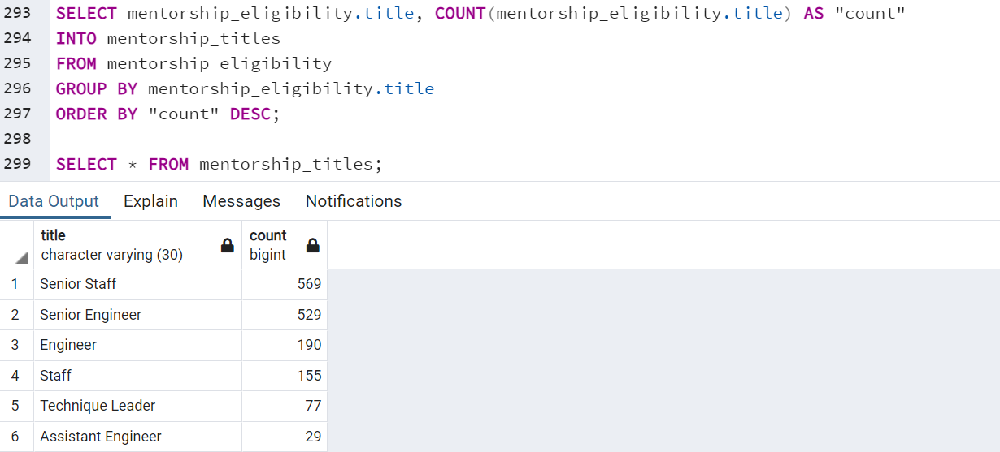

# Pewlett-Hackard-Analysis
## Overview of the analysis:
- Working with Bobby, we have created an Employee Database with **SQL** for Pewlett-Hackard in an effort to provide them with as much information as possible on their company's current standing with the "Silver Tsunami". We were provided with six original csv files with data about the companies over 300k employees based on Salary, Departments, Managers, Titles, and Empoyment dates. We then created an **Entity Relationship Diagram (ERD)** and got to work in **PostgresSQL** using **pgAdmin** to design and manage tables.
- The latest projects requested were a table and csv file listing the number of employees retiring by title and a table and csv file listing the number of employees eligible for the Mentorship Program. These lists will help Pewlett-Hackard understand just how many "baby boomers" they have leaving the workforce by each title and if they have enough employees eligible for the Mentorship Program.     

## Results:

- Pewlett Hackard stands to lose **63.8%** of their Senior titled staff to retirment over the next few years.
- As previously discovered, there are only **five** active managers in the company, two of those managers are slated to retire as well.

- There are only 1,549 eligible employees eligible for the Mentorship Program.
- The Mentorship Program currently specifies only employees who were born between January 1, 1965 and December 31, 1965. This could be expanded to amp up the number of eligible employees.

## Summary:
1. How many roles will need to be filled as the "silver tsunami" begins to make an impact?
- Over the next few years, Pewlett Hackard can expect to lose up to 90,398 employees just in relation to coming of retirement age. They may not have to fill all of these roles with new technologies automating many administrative tasks, but they will certainly have a large gap to fill. 
2. Are there enough qualified, retirement-ready employees in the departments to mentor the next generation of Pewlett Hackard employees?
- No, there are only 1,549 eligible employees to mentor the next generation of Pewlett Hackard employees. A large deficit from the more than 90k imminently retiring employees. 

### Additional Silver Tsunami Suggested Queries:
1. The first query I would suggest (shown below), can be used to compare to the earlier table we made that shows retirement counts by titles. 

2. The second query I would suggest (shown below), can be used to see how much the company can afford to spend on new employees, training, salaries and retirement packages.
